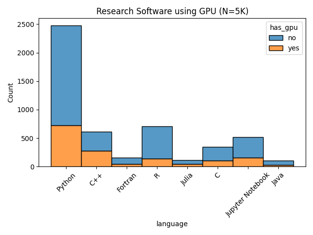
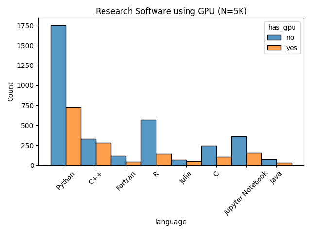

# GPU Search

Let's find software in the [RSEPedia](https://openresearchsoftware.metajnl.com/articles/10.5334/jors.359) that mentions or uses GPUs. We will break apart by language. We want to be able to say "X python projects support gpu" where X is an estimate based on finding "cuda" or "gpu" mentioned in the code.

## Usage

### Parsing

Because the research software encyclopedia is a database, this is fairly easy to implement this analysis. And we can be lazy and do one off git clones and cleanups to get the latest commit. First, download the database:

```bash
git clone --depth 1 https://github.com/rseng/software /tmp/software
```

Here is the version we got:

```console
Author: Vanessasaurus <814322+vsoch@users.noreply.github.com>
Date:   Sat Nov 2 20:04:53 2024 -0600

    Merge pull request #397 from rseng/update/software-2024-11-03
    
    Update from update/software-2024-11-03
```

Then install dependencies:

```bash
python -m venv env
source env/bin/activate
pip install -r requirements.txt
```

And run the script, targeting the database.

```bash
python find-gpus.py --settings-file /tmp/software/rse.ini -o ./data
```

### Analysis

This generates the following plots - I made them each of stacked and not stacked, and filtered
out languages that had fewer than 50 records. Note also that I intended to filter out languages HTML and JavaScript, and did this on the level of the data frame, but not the initial parsing (my capitalization was wrong).
The reason we want to is that the strings happen to show up in minimized JavaScript (and HTML) as garbled, and this is erroneous.

These plots represent a collection of 5K records of Research Software assembled from the Research Software Encyclopedia since ~2020. The search was a grep that looked for (with any casing):

```console
nccl|gpu|cuda|rocm|openacc|opencl|nvidia
```

And excluded hidden directories, html and svg files, and any lock files. The creation date of the RSEPedia does not reflect the age of the software, which can go back easily to ~2010 (dating before GitHub to projects that were hosted elsewhere and moved). These repos were added to the RSEPedia on publication or similar, but must be currently active as the data here was parsed on November 6-7 2024. The sources include the [scrapers listed here](https://rseng.github.io/rse/getting-started/scrapers/index.html) that are still running weekly:

- Astrophysics Source Code Library
- The Journal of Open Source Software (JoSS)
- BioGrids by Harvard Medical School
- bio.tools
- Debian Med
- Hal Research Software Database
- Research Software NL Dictionary
- ROpenSci
- The Molecular Sciences Software Institute
- The Imperial College London Research Software Directory



